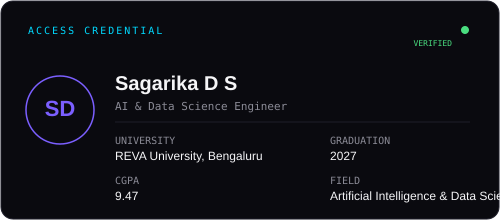
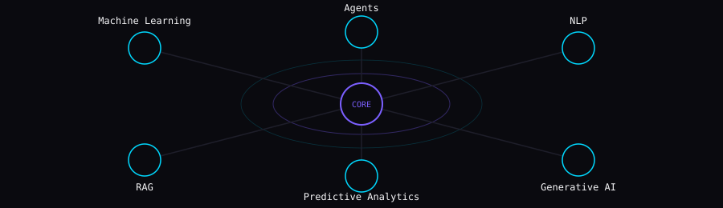
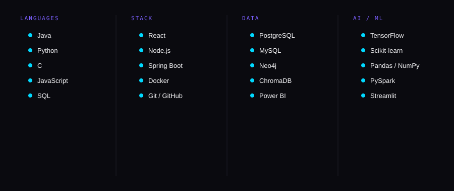
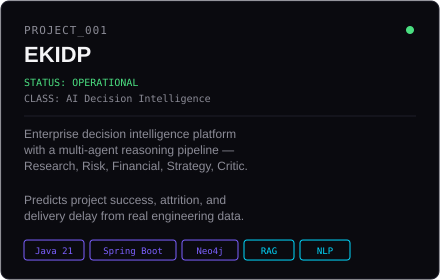
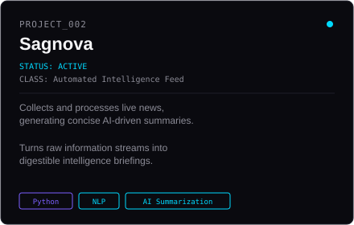
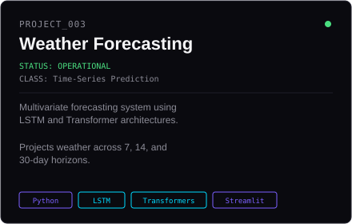
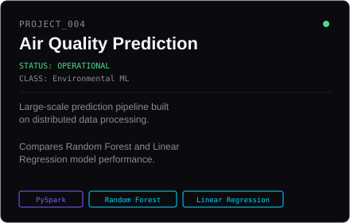

<!-- 
  If you're reading this, you found the source.
  System: SAGARIKA.exe — status: running, always building.
-->

Focus areas: AI & Data Science Engineer • Full Stack Developer • GenAI / RAG • Problem Solver • ML/AI Enthusiast • Backend Engineer • Data Engineer • Developer • Cloud

NEURAL CORE

The systems I build around — where models, retrieval, and reasoning connect.

TECHNOLOGY MATRIX

PROJECT UNIVERSE

  

## EXPERIMENT LAB

<b>Click to view active experiments</b>

 
01 → AI Agents
02 → Advanced Spring Boot
03 → Cloud Architecture
04 → System Design
05 → Generative AI
06 → Developer Tools

## GITHUB TELEMETRY

**View live activity →** [github.com/sagarika-ds](https://github.com/sagarika-ds)

TRANSMISSION CHANNELS

Systems that think. Systems that move.

GITHUB TELEMETRY

