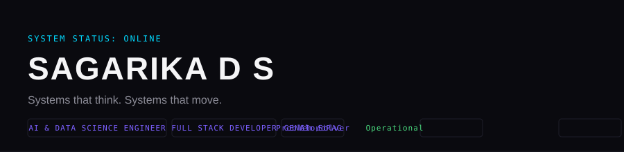

 

## IDENTITY CARD

<pre>
NAME        : Sagarika D S
FIELD       : Artificial Intelligence & Data Science
UNIVERSITY  : REVA University, Bengaluru
GRADUATION  : 2027
CGPA        : 9.47
</pre>

**Focus areas:** AI & Data Science Engineer • Full Stack Developer • GenAI / RAG • Problem Solver • ML/AI Enthusiast • Backend Engineer • Data Engineer • Developer • Cloud

 

## NEURAL CORE

The systems I build around — where models, retrieval, and reasoning connect.

 
TECHNOLOGY MATRIX

<table>
<tr><td><b>Languages</b></td><td>Java • Python • C • JavaScript • SQL</td></tr>
<tr><td><b>Frontend / Backend</b></td><td>React • Node.js • Spring Boot</td></tr>
<tr><td><b>Databases</b></td><td>PostgreSQL • MySQL • Neo4j • ChromaDB</td></tr>
<tr><td><b>AI / ML</b></td><td>TensorFlow • Scikit-learn • Pandas • NumPy • PySpark</td></tr>
<tr><td><b>Data / Visualization</b></td><td>Streamlit • Power BI</td></tr>
<tr><td><b>Tools</b></td><td>Docker • Git • GitHub</td></tr>
</table>

 
## PROJECT UNIVERSE

<table>
<tr>
<td width="50%" valign="top">

**PROJECT_001 — EKIDP**
<pre>
STATUS : OPERATIONAL
CLASS  : AI Decision Intelligence
</pre>

Enterprise Knowledge Intelligence & Decision Platform — prevents organizational knowledge loss and accelerates executive decisions through a multi-agent pipeline (Research → Risk → Financial → Strategy → Critic → Final Decision).

Predicts project success, attrition, cost overrun, and delivery delay using ML models on top of a Java/Spring Boot backend with Neo4j + ChromaDB for knowledge retrieval.

`Java 21` `Spring Boot` `PostgreSQL` `Neo4j` `ChromaDB` `RAG` `NLP`

</td>
<td width="50%" valign="top">

**PROJECT_002 — AI News Intelligence**
<pre>
STATUS : ACTIVE
CLASS  : Automated Intelligence Feed
</pre>

Collects and processes live news, generating concise AI-driven summaries — turning raw information streams into digestible intelligence briefings.

`Python` `NLP` `AI Summarization`

</td>
</tr>
<tr>
<td width="50%" valign="top">

**PROJECT_003 — Weather Forecasting**
<pre>
STATUS : OPERATIONAL
CLASS  : Time-Series Prediction
</pre>

Multivariate forecasting system using LSTM and Transformer architectures, projecting weather across 7, 14, and 30-day horizons.

`Python` `LSTM` `Transformers` `Streamlit`

</td>
<td width="50%" valign="top">

**PROJECT_004 — Air Quality Prediction**
<pre>
STATUS : OPERATIONAL
CLASS  : Environmental ML
</pre>

Large-scale air quality prediction pipeline built on distributed data processing, comparing Random Forest and Linear Regression models.

`PySpark` `Random Forest` `Linear Regression`

</td>
</tr>
</table>

 
